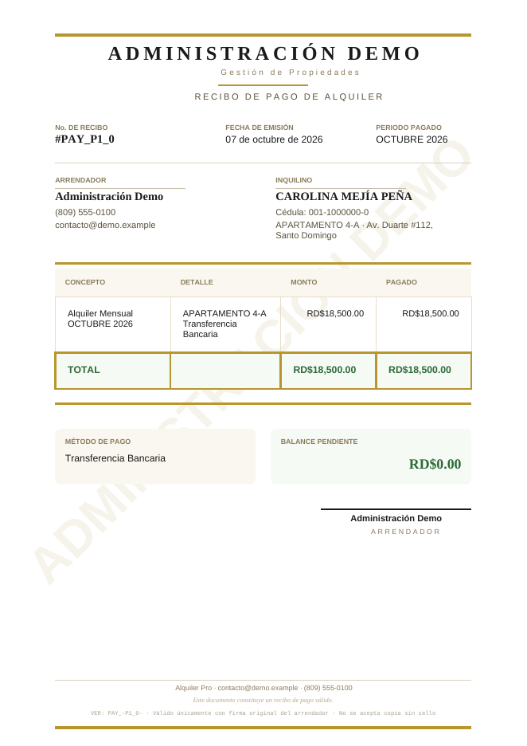

<div align="center">


# Alquiler Pro

**Gestión de alquileres simple, clara y a la medida.**
Propiedades, edificios, inquilinos, pagos, recibos y reportes en un solo lugar.

[](CHANGELOG.md)
[](https://react.dev)
[](https://supabase.com)
[](docs/DEPLOY.md)
[](LICENSE)

**Español** · [English](README.en.md)


<sub>Capturas con datos de demostración ficticios.</sub>

</div>

---

## ¿Qué es Alquiler Pro?

Alquiler Pro es una aplicación web para **propietarios y administradores de inmuebles** que necesitan saber, de un vistazo, **quién pagó, quién debe y cuánto** — sin hojas de cálculo, sin cuadernos y sin perder el historial.

Registras tus edificios, propiedades e inquilinos; anotas los pagos (uno o varios meses a la vez); y la app te dice el estado real de cada cuenta, genera recibos y reportes en PDF listos para enviar al cliente y deja un registro de todo lo que se hizo y quién lo hizo.

## ¿Para quién es?

| Si eres… | Te sirve para… |
|---|---|
| Propietario con varias unidades | Ver en una pantalla qué inquilinos están al día, pendientes o atrasados. |
| Administrador de edificios o residenciales | Agrupar unidades por edificio, controlar ocupación y renta total. |
| Inmobiliaria pequeña o mediana | Trabajar en equipo sobre los mismos datos y auditar quién hizo cada cambio. |
| Quien hereda o recibe cartera de alquileres | Corregir el historial (meses pendientes o "nulos") sin perder información. |

## Funciones principales

| Área | Qué incluye |
|---|---|
| **Inicio** | Indicadores (cobrado del año, monto atrasado, ocupación, tasa de cobro), buscador y filtros, registro de actividad, alertas de pago. |
| **Propiedades** | Alta y edición, datos físicos, renta, inquilino opcional en el mismo formulario, **incremento anual con fecha del primer aumento**, estado anual de 12 meses. |
| **Edificios** | Nombre y dirección, ficha de detalle con unidades, ocupación, renta total y atrasos; las propiedades toman la dirección del edificio. |
| **Inquilinos** | Activos y **antiguos** (histórico con período y pagos), desvincular sin borrar nada, reporte por inquilino. |
| **Pagos** | Pago de un mes o de **varios a la vez**, abonos parciales, edición de pagos, meses **pendientes** o **nulos** (no cobrados). |
| **Servicios** | Lecturas de gas, luz y agua con cálculo de consumo y costo; control de pagados y pendientes. |
| **Documentos** | Recibos y **reportes de pagos en PDF** con tu marca, datos y firma; recibo opcional tras cada pago. |
| **Equipo** | Varias cuentas trabajando sobre los mismos datos, con titular y miembros. |
| **Trazabilidad** | Registro de actividad: quién registró, editó, eliminó o imprimió, y cuándo. |

## Capturas

<table>
  <tr>
    <td width="50%"><br/><sub><b>Propiedad:</b> inquilino, estado anual y pagos. Los meses grises rayados son "nulos".</sub></td>
    <td width="50%"><br/><sub><b>Editar meses:</b> marca meses como pendientes o nulos en lote.</sub></td>
  </tr>
  <tr>
    <td><br/><sub><b>Pagar varios meses</b> en un solo paso, con recibo opcional.</sub></td>
    <td><br/><sub><b>Buscador de propiedades</b> por nombre, edificio, dirección o inquilino.</sub></td>
  </tr>
  <tr>
    <td><br/><sub><b>Edificios:</b> unidades, ocupación y renta.</sub></td>
    <td><br/><sub><b>Inquilinos antiguos:</b> histórico con sus pagos.</sub></td>
  </tr>
  <tr>
    <td><br/><sub><b>Reporte de pagos</b> en PDF para enviar al cliente.</sub></td>
    <td><br/><sub><b>Recibo</b> con tu marca y firma.</sub></td>
  </tr>
</table>

## Cómo funciona

1. **Crea tu espacio.** Regístrate e inicia sesión; en Ajustes → Factura configura el nombre del negocio, contacto y firma que saldrán en tus PDFs.
2. **Registra tus inmuebles.** Crea edificios (opcional), agrega propiedades con su renta y asigna a cada una su inquilino.
3. **Cobra.** Desde Inicio o desde la propiedad registra el pago de uno o varios meses. La app te ofrece el recibo (*Sí, imprimir* / *Ahora no*).
4. **Revisa el estado.** Cada propiedad muestra si está **al día**, **pendiente** o **atrasada** y exactamente qué meses se deben.
5. **Corrige y comparte.** Edita pagos, marca meses pendientes o nulos, saca reportes en PDF y trabaja en equipo; todo queda en el registro de actividad.

### Cómo se calcula el estado de pago

La app revisa **mes a mes**, desde que el inquilino entró hasta hoy. Los meses **pasados** sin pago completo son los que se "deben"; el mes actual aún se está cobrando.

| Estado | Cuándo | Ejemplo (hoy es octubre) |
|---|---|---|
| 🟢 **Al día** | No se debe ningún mes pasado (puede faltar solo el mes actual). | "Mes actual (oct 2026) por pagar" |
| 🟡 **Pendiente** | Se debe un mes pasado, normalmente el anterior. | "Debe sep 2026" |
| 🔴 **Atrasado** | Se deben dos o más meses pasados. | "Debe jul – sep 2026 (3 meses)" |

Los meses marcados **nulos** (no se cobraron ni se cobrarán: apartamento vacío, acuerdo especial…) **no cuentan** como deuda ni en la tasa de cobro.

## Tecnología

React 18 · Vite 5 · Tailwind CSS 3 · React Router 6 · Supabase (PostgreSQL, Auth, Row Level Security) · jsPDF · date-fns · lucide-react · Vercel.

## Inicio rápido

**Requisitos:** Node.js 18 o superior y un proyecto de [Supabase](https://supabase.com).

```bash
git clone https://github.com/W4773/rental-management-system.git
cd rental-management-system
npm install

cp .env.example .env        # y completa tus credenciales de Supabase
npm run dev                  # http://localhost:5173
```

```env
VITE_SUPABASE_URL=https://TU-PROYECTO.supabase.co
VITE_SUPABASE_ANON_KEY=tu-anon-key
```

La app usa el esquema **`rental`** de Supabase. Las migraciones están en [`supabase/migrations`](supabase/migrations) y se explican, en orden, en [docs/DATABASE.md](docs/DATABASE.md). Para publicar en Vercel sigue [docs/DEPLOY.md](docs/DEPLOY.md).

## Documentación

| Documento | Contenido |
|---|---|
| [Guía de uso](docs/USER_GUIDE.md) | Paso a paso de cada pantalla y flujo. |
| [Arquitectura](docs/ARCHITECTURE.md) | Cómo está construida la app. |
| [Base de datos y migraciones](docs/DATABASE.md) | Tablas, seguridad y orden de migraciones. |
| [Despliegue](docs/DEPLOY.md) | Vercel + Supabase. |
| [Roadmap](docs/ROADMAP.md) | Qué hay, qué viene y qué se evalúa. |
| [Cambios](CHANGELOG.md) | Historial de versiones. |

## Roadmap

**Ahora (v1.x):** estado de pago por meses · edición y anulación de meses · edificios · equipo · registro de actividad · reportes y recibos PDF.
**Próximo:** aplicar los aumentos anuales automáticamente · avisos de atraso por WhatsApp y correo · exportación a Excel · contratos y depósitos · roles con permisos · versión móvil (PWA).
**Más adelante:** portal del inquilino · cobros en línea · comprobantes fiscales (NCF) · multi-moneda · API pública.

Detalle en [docs/ROADMAP.md](docs/ROADMAP.md).

## Seguridad y privacidad

- Autenticación con Supabase Auth y **Row Level Security** en cada tabla: cada equipo solo ve sus datos.
- El front solo usa la clave pública (*anon key*); nunca incluyas la `service_role` en el código ni en el repositorio.
- Este repositorio no debe contener datos reales de clientes (los respaldos y archivos locales están en `.gitignore`).
- ¿Encontraste una vulnerabilidad? Lee [SECURITY.md](SECURITY.md).

## Soporte y contacto

**Optimard** — soluciones digitales a la medida.
✉️ [optimard@innovaflowtech.com](mailto:optimard@innovaflowtech.com) · 💬 WhatsApp [+1 (809) 710-6760](https://wa.me/18097106760)

## Licencia

© 2026 Optimard. Todos los derechos reservados. Software propietario: ver [LICENSE](LICENSE).
