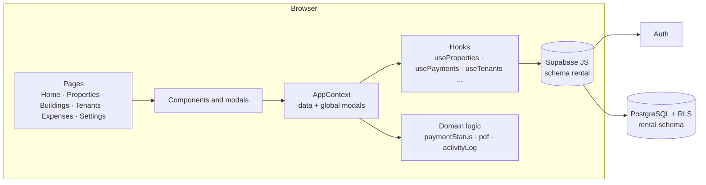

# Architecture · Alquiler Pro

[Español](ARCHITECTURE.md) · **English** · [← README](../README.en.md)

Alquiler Pro is a React **SPA** (single-page application) that talks directly to **Supabase** (PostgreSQL + Auth). There is no custom server: security rests on the database's **Row Level Security (RLS)**.



## Layers

| Layer | Where | Responsibility |
|---|---|---|
| Pages | `src/pages` | Screens and routes: `/`, `/propiedades`, `/edificios`, `/inquilinos`, `/gastos`, `/settings`, `/login`, `/register`. |
| Components | `src/components` | Reusable UI: property list and detail, yearly strip, modals (payment, edit, void, building, tenant…), searchable selector. |
| State | `src/contexts/AppContext.jsx` | Loads properties, tenants, payments, utilities, buildings, settings and activity once; exposes `openX()` to open modals and `refreshAll()` (no page reloads). |
| Data | `src/hooks` | One hook per table with the CRUD operations against Supabase; they log activity. |
| Domain | `src/lib` | Pure, easily testable business rules. |

## Domain: key modules (`src/lib`)

| Module | What it does |
|---|---|
| `paymentStatus.js` | `getMonthStatus` (paid / partial / pending / void / future per month) and `getPaymentStatus` (Up to date · Pending · Late with month detail). Single source of truth for lists, alerts and KPIs. |
| `pdfGenerator.js`, `pdfHelpers.js`, `reportGenerator.js` | Receipts (one or several months) and payment reports with branding and signature, using jsPDF. |
| `activityLog.js`, `activityFormat.js` | "Who did what" log and its readable text. |
| `rentIncrease.js` | Next annual increase and resulting rent. |
| `effectiveOwner.js` | The owner of the workspace the user belongs to. |
| `calculations.js`, `dateUtils.js`, `validators.js` | Formatting, dates and validation. |

## Multi-user: workspaces and effective owner

Every data row belongs to an **owner** (`user_id`). A team member (`rental.workspace_members`) works on their owner's data: `rental.effective_owner_id()` returns on whose behalf new rows are stored, and the RLS policies allow rows of the user and of their owner (`rental.my_workspace_owner_ids()`).

## Payment model

- A property's **month** is represented by rows of `rent_payments` (`payment_month` = day 1).
- **Paid / partial:** rows with `amount_paid > 0`. A month is paid if there is a `full` row or the sum reaches the rent.
- **Generated history:** registering a tenant creates paid rows with `auto_generated = true` for the months before last month.
- **Explicit pending:** row with `amount_paid = 0`; **void:** row with `voided = true` (+ `void_reason`). Both are real rows so the automatic history back-fill never reverts them.
- **No row:** a past month without payments is considered owed.

### Payment status algorithm

```text
for each month from the tenant's move-in month until today:
    state = getMonthStatus(...)                # paid | partial | pending | void | future
    if void              -> ignored
    if current month     -> "current month missing" (not overdue debt)
    if not paid          -> added to the owed months
owed = list of unpaid past months
if ≥ 2 months -> LATE      ("Owes jul – sep 2026 (3 months)")
if = 1 month  -> PENDING   ("Owes sep 2026")
if = 0        -> UP TO DATE ("Current month (oct 2026) to pay" / "Paid through oct 2026")
```

## Activity log

Every hook operation calls `logActivity({ action, entityType, entityId, meta })`, which inserts into `rental.activity_log` with the owner, the actor and a snapshot of names in `meta` (so the text stays readable even if the entity is later deleted). It is fire-and-forget: if the table does not exist yet, the app still works.

## Conventions

- Spanish UI; code and technical comments in English.
- Styling with Tailwind + brand tokens (`brand`, `cream`, `ink`) and `wp-*` classes for badges.
- New features that need new columns or tables **degrade gracefully**: they say which migration is missing instead of breaking.
- Layout:

```text
src/
  pages/        screens
  components/   Common · Layout · Dashboard · Modals · Settings · AlertDrawer
  contexts/     AuthContext · AppContext
  hooks/        data access and filters
  lib/          domain, PDFs, utilities
supabase/migrations/   database changes
docs/                  documentation and images
```
