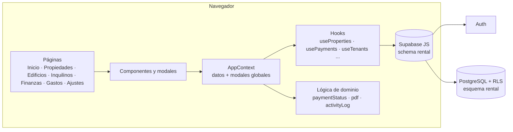

# Arquitectura · Alquiler Pro

**Español** · [English](ARCHITECTURE.en.md) · [← README](../README.md)

Alquiler Pro es una **SPA** (aplicación de una sola página) en React que habla directamente con **Supabase** (PostgreSQL + Auth). No hay servidor propio: la seguridad descansa en **Row Level Security (RLS)** de la base de datos.



## Capas

| Capa | Dónde | Responsabilidad |
|---|---|---|
| Páginas | `src/pages` | Pantallas y rutas: `/`, `/propiedades`, `/edificios`, `/edificios/:id`, `/inquilinos`, `/finanzas`, `/gastos`, `/settings`, `/login`, `/register`. |
| Componentes | `src/components` | UI reutilizable: lista y detalle de propiedad, cuadrícula anual, modales (pago, edición, nulos, edificio, inquilino…), selector con buscador. |
| Estado | `src/contexts/AppContext.jsx` | Carga una sola vez propiedades, inquilinos, pagos, servicios, edificios, ajustes y actividad; expone `openX()` para abrir modales y `refreshAll()` (sin recargar la página). |
| Datos | `src/hooks` | Un hook por tabla con las operaciones CRUD contra Supabase; registran la actividad. |
| Dominio | `src/lib` | Reglas de negocio puras y fáciles de probar. |

## Dominio: piezas clave (`src/lib`)

| Módulo | Qué hace |
|---|---|
| `paymentStatus.js` | `getMonthStatus` (pagado / parcial / pendiente / nulo / futuro por mes) y `getPaymentStatus` (Al día · Pendiente · Atrasado con el detalle de meses). Una sola fuente de verdad para listas, alertas e indicadores. |
| `pdfGenerator.js`, `pdfHelpers.js`, `reportGenerator.js` | Recibos (uno o varios meses) y reportes de pagos con marca y firma, con jsPDF. |
| `activityLog.js`, `activityFormat.js` | Registro "quién hizo qué" y su texto legible. |
| `rentIncrease.js` | Próximo aumento anual y renta resultante. |
| `effectiveOwner.js` | Titular del *workspace* al que pertenece el usuario. |
| `calculations.js`, `dateUtils.js`, `validators.js` | Formatos, fechas y validaciones. |

## Multiusuario: workspaces y titular efectivo

Cada fila de datos pertenece a un **titular** (`user_id`). Un miembro de equipo (`rental.workspace_members`) trabaja sobre los datos de su titular: la función `rental.effective_owner_id()` devuelve a nombre de quién se guardan las filas nuevas, y las políticas RLS dejan ver las filas del propio usuario y las de su titular (`rental.my_workspace_owner_ids()`).

## Modelo de pagos

- Un **mes** de una propiedad se representa con filas de `rent_payments` (`payment_month` = día 1).
- **Pagado / parcial:** filas con `amount_paid > 0`. Un mes se considera pagado si hay una fila `full` o la suma alcanza la renta.
- **Histórico generado:** al registrar un inquilino se crean filas pagadas con `auto_generated = true` para los meses anteriores al mes pasado.
- **Pendiente explícito:** fila con `amount_paid = 0`; **nulo:** fila con `voided = true` (+ `void_reason`). Ambas son filas reales para que el relleno automático del histórico no las revierta.
- **Sin fila:** un mes pasado sin pagos se considera adeudado.

### Algoritmo del estado de pago

```text
para cada mes desde el mes de ingreso del inquilino hasta hoy:
    estado = getMonthStatus(...)               # pagado | parcial | pendiente | nulo | futuro
    si es nulo            -> se ignora
    si es el mes actual   -> "falta el mes actual" (no es deuda vencida)
    si no está pagado     -> se agrega a los meses adeudados
adeudados = lista de meses pasados no pagados
si ≥ 2 meses  -> ATRASADO   ("Debe jul – sep 2026 (3 meses)")
si = 1 mes    -> PENDIENTE  ("Debe sep 2026")
si = 0        -> AL DÍA     ("Mes actual (oct 2026) por pagar" / "Pagado hasta oct 2026")
```

## Registro de actividad

Cada operación de los hooks llama a `logActivity({ action, entityType, entityId, meta })`, que inserta en `rental.activity_log` con el titular, el autor y un *snapshot* de nombres en `meta` (para que el texto siga siendo legible aunque se borre la entidad). Es "fire and forget": si la tabla aún no existe, la app funciona igual.

## Convenciones

- Español en la interfaz; código y comentarios técnicos en inglés.
- Estilos con Tailwind + tokens de marca (`brand`, `cream`, `ink`) y clases `wp-*` para insignias.
- Las funciones nuevas que necesitan columnas o tablas nuevas **degradan con gracia**: avisan qué migración falta en lugar de romper.
- Estructura:

```text
src/
  pages/        pantallas
  components/   Common · Layout · Dashboard · Modals · Settings · AlertDrawer
  contexts/     AuthContext · AppContext
  hooks/        acceso a datos y filtros
  lib/          dominio, PDFs, utilidades
supabase/migrations/   cambios de base de datos
docs/                  documentación e imágenes
```
