# User guide · Alquiler Pro

[Español](USER_GUIDE.md) · **English** · [← Back to the README](../README.en.md)

This guide walks through the app screen by screen. Screenshots use fictitious demo data. The interface itself is in Spanish; button names are quoted as they appear.

## Contents

1. [Getting started](#1-getting-started)
2. [Buildings](#2-buildings)
3. [Properties](#3-properties)
4. [Tenants](#4-tenants)
5. [Recording payments](#5-recording-payments)
6. [Fixing history: edit months](#6-fixing-history-edit-months)
7. [Utilities: gas, electricity and water](#7-utilities-gas-electricity-and-water)
8. [PDF receipts and reports](#8-pdf-receipts-and-reports)
9. [Search and filters](#9-search-and-filters)
10. [Alerts and activity log](#10-alerts-and-activity-log)
11. [Team](#11-team)
12. [Finance](#12-finance)
13. [Collection letter](#13-collection-letter)
14. [FAQ](#14-faq)

---

## 1. Getting started

1. Create your account under **Registro** (sign up) and log in.
2. Open **Ajustes → Factura** (gear icon) and fill in: business name, landlord name, phone, email, invoice footer and your **signature**. These appear on all your PDFs.
3. Navigate with the header tabs: **Inicio (Home) · Propiedades · Edificios · Inquilinos · Gastos**. The *Alquiler Pro* logo always takes you Home.

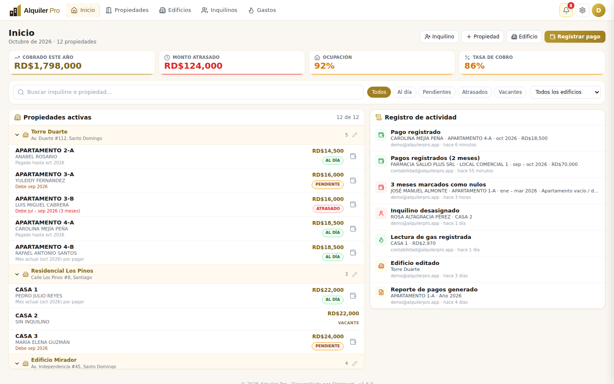

**Home** gathers the yearly KPIs, the property list (grouped by building) with its payment status and the **activity log**. The bell shows payment alerts.

## 2. Buildings

**Edificios → + Nuevo edificio.** Enter a name and address. From the same screen you can:

- **Edit** (pencil) the name or address. If you change the address, units that shared the building's address are updated.
- **Delete** a building: its properties are **not deleted**, they become "Sin edificio" (no building).
- **Assign** loose properties to a building with the selector in the "Sin edificio" section.

Each building has **its own colour** (automatic and fixed) in the Buildings view and in Properties, shared by its units and tenants, and units are listed alphabetically. The circle on each unit works as a traffic light: **green** up to date, **yellow** 1 month pending, **red** 2 or more months and **grey** vacant; the counters split *Pendientes* (pending) and *Atrasadas* (late). Each card shows units, occupancy, total monthly rent and how many are late. **Click the building name (or "Ver")** to open its detail page.

### Building detail

Shows the building's data, its indicators (units, occupancy, monthly rent, overdue amount) and every unit with its tenant and payment status. You can search, filter (All · Occupied · Vacant · Late), **Cobrar** (collect) on an occupied unit, **Asignar inquilino** (assign a tenant) to a vacant one, **Edit building** or **Add property** (it is created inside the building and takes its address automatically).

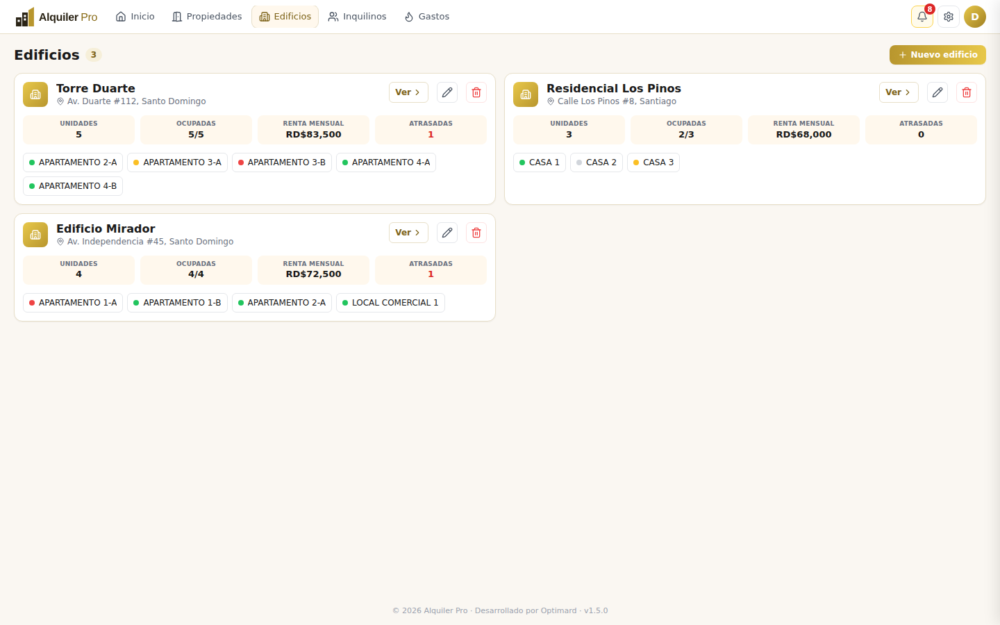

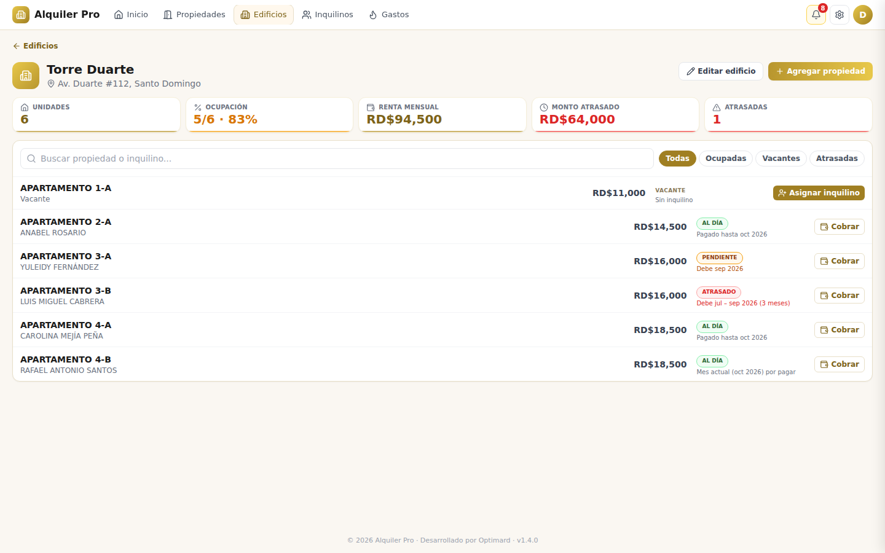

## 3. Properties

**Propiedades → + Nueva propiedad.** Enter name or code, building (optional; if you pick one the address is optional), monthly rent, bedrooms and bathrooms. Further down you'll find extra details (type, square meters, notes).

**All-in-one registration.** At the bottom of the form, below the *opcional* line, you can enter the **current tenant** (name, ID, phone, email, move-in date and deposit) and everything is saved in a single step. Leave it empty to create only the property.

**Annual increase (optional).** Choose a percentage or a fixed amount and, optionally, the **date of the first increase**: the day it takes effect for the first time; it then repeats every year on that date. The property detail shows a line such as *"Aumento anual: 5% · próximo el 01/01/2027 → RD$19,425"*. It is informational: the rent does not change by itself.

To edit or delete a property use the icons in the top-right corner of its detail. Deleting also removes its history; the app asks for confirmation.

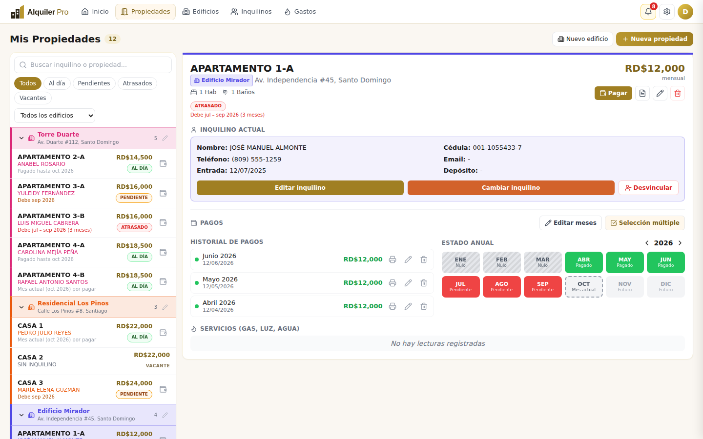

## 4. Tenants

- **Assign:** on a vacant property click *Asignar inquilino* (or **Inquilinos → + Nuevo inquilino** and pick the property with the search box). It asks for name, ID number, phone, email (optional), **deposit (optional)** and move-in date.
- **Edit** the current tenant: *Editar inquilino*.
- **Change tenant:** registers a new one; the previous tenant moves to "Antiguos" (former) with their history.
- **Unlink:** *Desvincular* button (on the property or in Tenants). The property becomes vacant and the tenant moves to **Antiguos**. **No payment is deleted.**

The **Inquilinos** tab has two views: **Activos** (active, with payment status) and **Antiguos** (former: property, period, total paid and every payment, plus a per-tenant *Reporte PDF*).

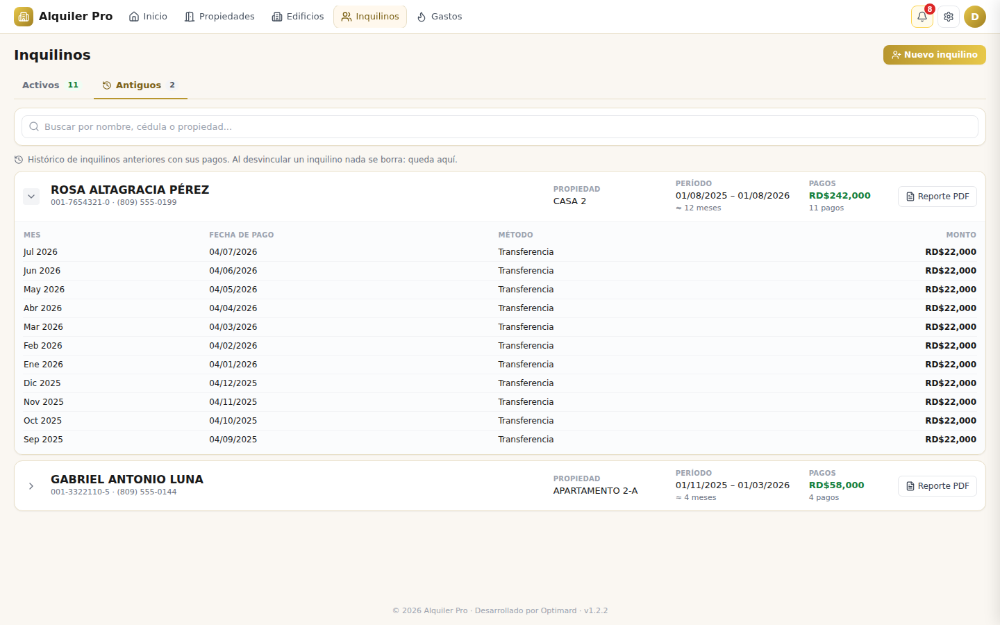

> When a tenant is registered, the app marks the months before last month as **paid** (history). If the tenant really arrives with arrears, fix it in [Edit months](#6-fixing-history-edit-months).

## 5. Recording payments

### One month

Click **Registrar pago** (Home) or **Pagar** (on the property), or click an unpaid month in the **Estado anual** strip. Pick the property (searchable), month, type (*full* or *partial*), date, method, reference and notes. Partial payments accumulate until the month's rent is complete.

### Several months at once

On the property detail, section **Pagos → Selección múltiple**: tick the pending months (or use *Marcar meses pendientes*) and click **Pagar N meses**. The balance of every month is recorded in one step.

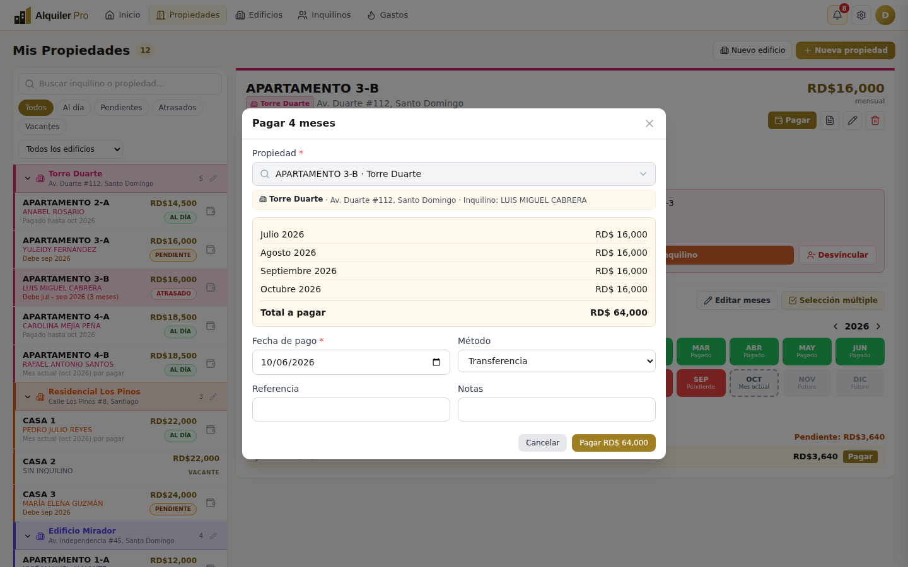

### Optional receipt

After saving, the app asks **¿Desea imprimir el recibo?** — *Sí, imprimir* downloads the PDF; *Ahora no* continues without printing. You can always print it later from the history (printer icon).

### Edit or delete a payment

In the **Historial de pagos** each row has three icons: **print**, **edit (pencil)** and **delete**. Editing lets you change amount, date, method, reference and notes; the month's balance and status are recalculated.

## 6. Fixing history: edit months

Use it when the history does not match reality: for example, a tenant you register today who **has months of arrears**, or months that **were not charged** because the unit was vacant.

1. On the property, **Pagos → Editar meses** (pencil icon). Change the year with the arrows if needed.
2. Tick the months to correct. Shortcut: **Todos los meses hasta hoy**.
3. Choose:
   - **Marcar pendiente** — the month is owed. It counts in the payment status and in the overdue amount.
   - **Marcar nulo…** — the month **was not and will not be charged**. Give the reason (vacant unit, agreement with the owner, maintenance or other). It does not count as debt nor in the collection rate; it shows as striped grey in the yearly strip.
   - **Quitar marca** — returns the month to "no record".

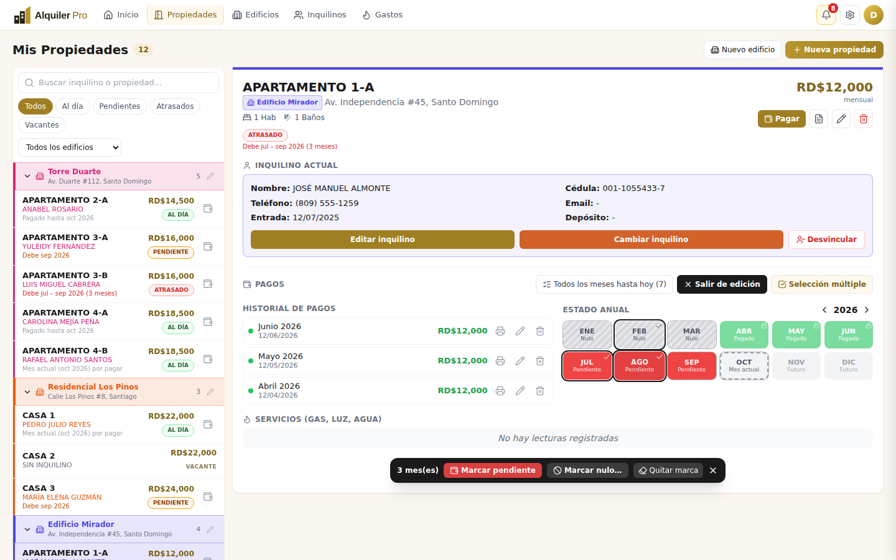

**Rules:** months with **registered payments** are locked (padlock): edit or delete that payment first. Auto-generated history months can be corrected. Future months cannot be edited.

## 7. Utilities: gas, electricity and water

**Gastos** has one tab per utility. **+ Registrar lectura** asks for property, date and current reading; the app takes the previous reading, computes consumption and cost with the rate you enter. Each reading stays *Pendiente* until you click **Pagar**. The property detail also lists its utilities and the pending amount.

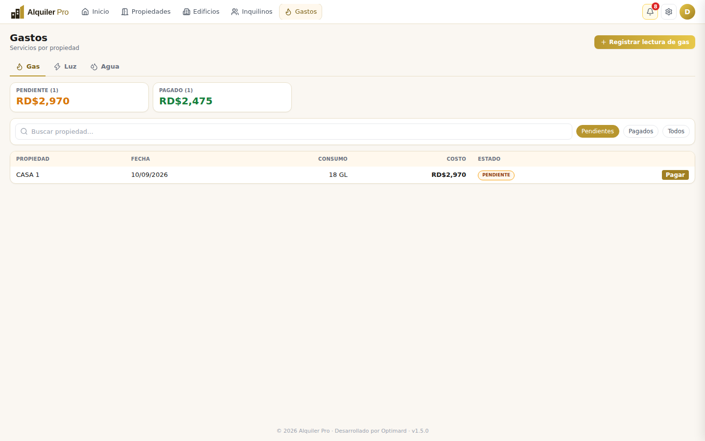

## 8. PDF receipts and reports

- **Receipt:** for one payment, or consolidated for several (tick payments in *Selección múltiple* → *Recibo*).
- **Payment report:** document icon on the property, or **Reporte PDF** on a tenant. Choose the year, full history or the ticked payments. It includes tenant and building details, total paid, pending amount and the payment table.

Both use the business name, contact details and signature from **Ajustes → Factura**.

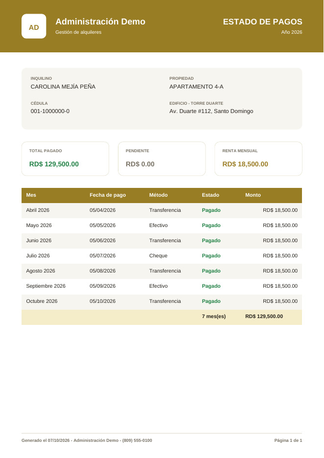

## 9. Search and filters

- On **Home** and **Properties**: search by tenant or property, filters **Al día / Pendientes / Atrasados / Vacantes** (up to date / pending / late / vacant) and by **building**.
- When you pick a property in a form (payments, assign tenant, utilities, reports) you get a **searchable selector**: type part of the name, building, address or tenant. Each option shows its building and tenant, so two "Apartamento 1-A" are never confused.

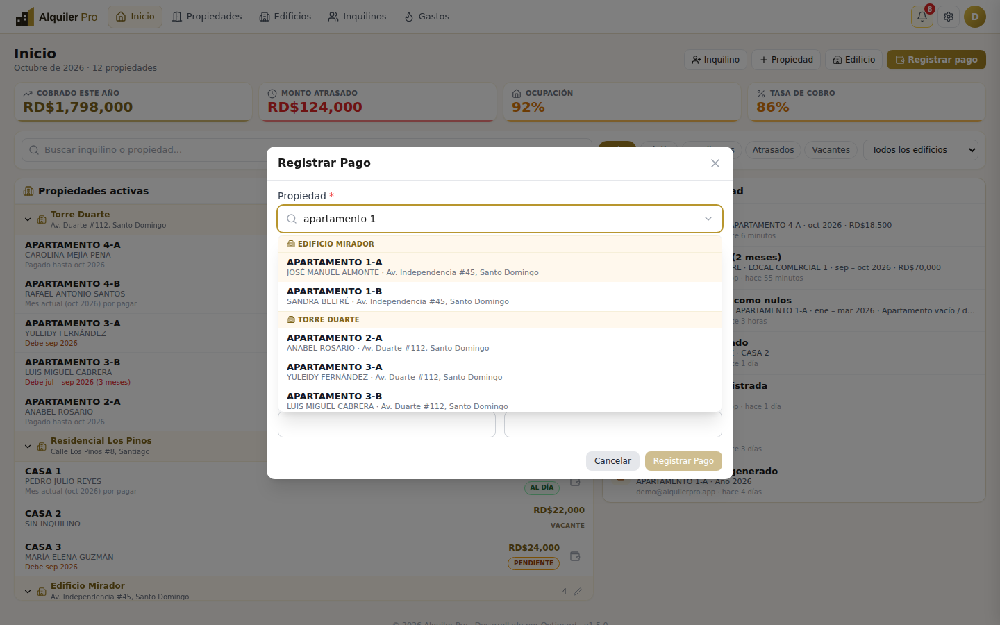

## 10. Alerts and activity log

- **Bell** in the header: overdue and soon-due months; each alert has *Registrar pago*.
- **Registro de actividad** (Home): payments, edits, marked months, tenants, buildings, utilities, receipts and reports, with **who** did it and **when**.

## 11. Team

**Ajustes → Equipo** lists the owner and members. The owner can **add** an account by email (it must already be registered in the app) or **remove** it. Members see and edit the same data and can **leave the team**.

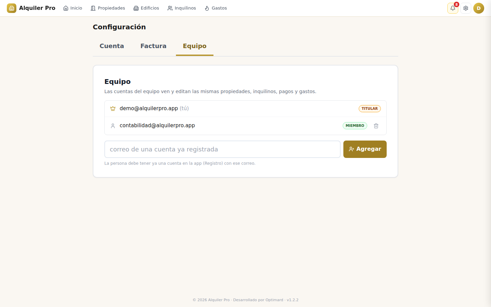

## 12. Finance

**Finanzas** (Finance) gathers the money analysis. Pick the **year** at the top to see: **collected**, **expected** (rent that was due until today, void months excluded), **collection rate**, **pending to collect** (overdue months not paid), monthly average and rent lost to vacant units.

- **Collected per month:** bars of money received against what was due (dotted outline).
- **Property status:** up to date, pending (1 month), late (2 or more) and vacant.
- **By building:** collected, pending, collection rate and pending/late unit counts.
- **Biggest debts** and **per-tenant detail** (search, column sorting, *Solo con deuda* filter and **Exportar CSV** for Excel).
- **Collected per year:** history of every year with payments.

*Incluir historial generado* adds or not the months the app marked as paid when a tenant was registered (same criterion as the "Cobrado este año" indicator on Inicio).

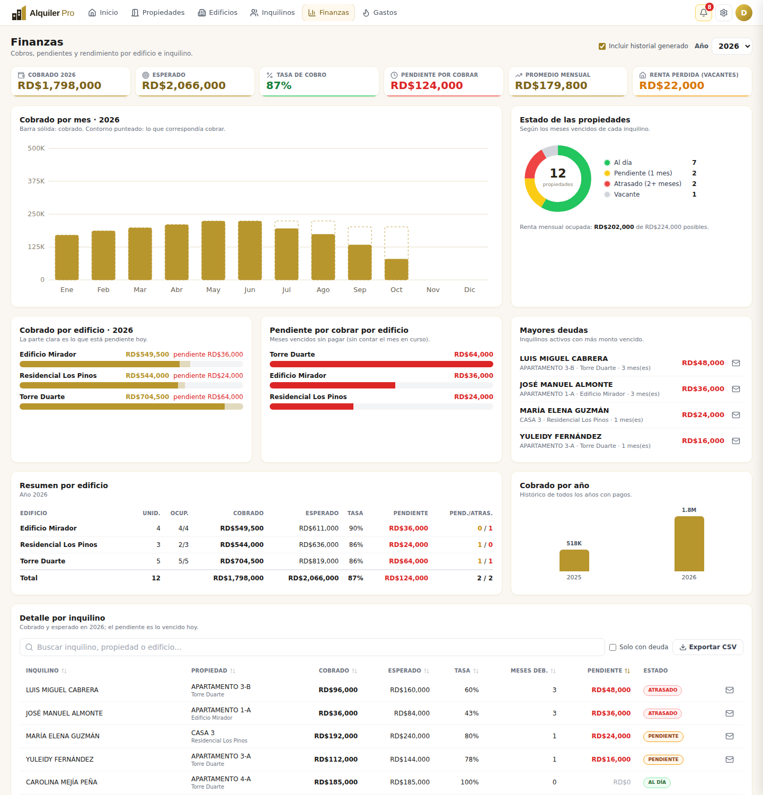

## 13. Collection letter

In **Ajustes → Carta de cobro** you define the letter sent to tenants with pending months. Write the text and use **variables** between `<<` and `>>`; they are replaced with each tenant's data. Click a variable to insert it at the cursor.

| Variable | Replaced by |
|---|---|
| `<<Nombre del inquilino>>`, `<<Cédula>>` | Tenant data |
| `<<Propiedad>>`, `<<Edificio>>`, `<<Dirección>>` | Property data |
| `<<Meses pendientes>>` | Number of overdue unpaid months |
| `<<Detalle de meses>>` | "julio, agosto y septiembre de 2026" |
| `<<Monto adeudado>>`, `<<Renta mensual>>` | Amounts in RD$ |
| `<<Fecha>>`, `<<Fecha límite>>` | Today and today + 5 days |
| `<<Nombre del propietario>>`, `<<Empresa>>`, `<<Teléfono>>`, `<<Correo>>` | Your Ajustes → Factura data |

There are two **base designs** (*Formal* and *Cordial*), letterhead, overdue-months table and signature options, a **live preview** and a sample PDF. A misspelled variable is flagged and printed as is.

To generate the letter for a tenant with pending months use the **Carta de cobro** button (envelope icon) in the property detail, in **Inquilinos** or in **Finanzas**: it downloads as a PDF. Saving the template requires `008_letter_template.sql` (see [DATABASE](DATABASE.md)).

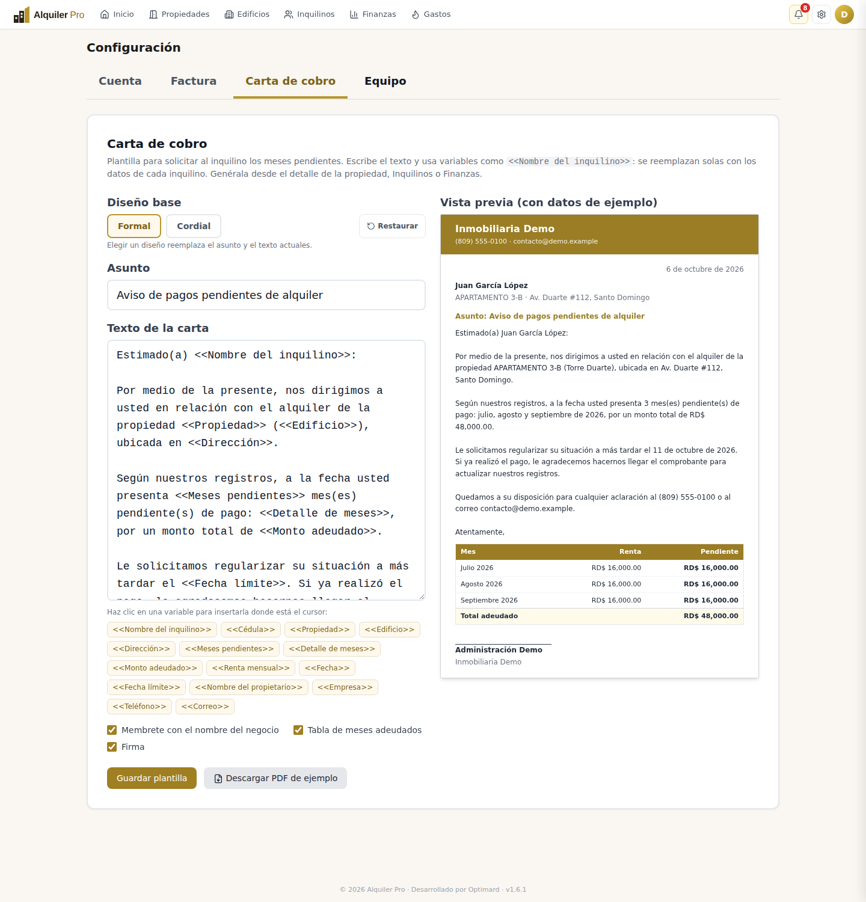

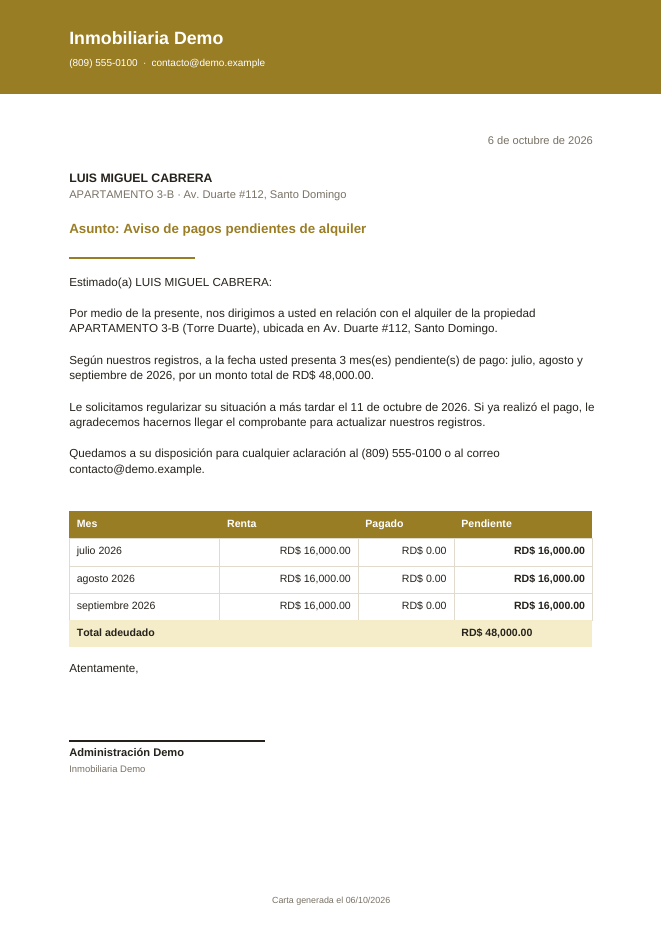

## 14. FAQ

**Why does a tenant show "Pendiente" if they already paid?**
Check the month: what is owed is the **previous month**, not the current one. Record that payment or, if it was not charged, mark it void in [Edit months](#6-fixing-history-edit-months).

**Is anything lost when I unlink a tenant?**
No. They move to *Antiguos* with all their payments and you can still produce their PDF report.

**What is the difference between "pendiente" (pending) and "nulo" (void)?**
Pending = owed. Void = never charged and never will be (not counted as debt).

**Why can't I edit a month?**
If it has registered payments it is locked (padlock): edit or delete the payment from the history. Future months can't be edited either.

**I see a notice asking me to run a migration.**
That feature needs a database update. Ask the administrator to run the indicated file (see [Database](DATABASE.md)).
