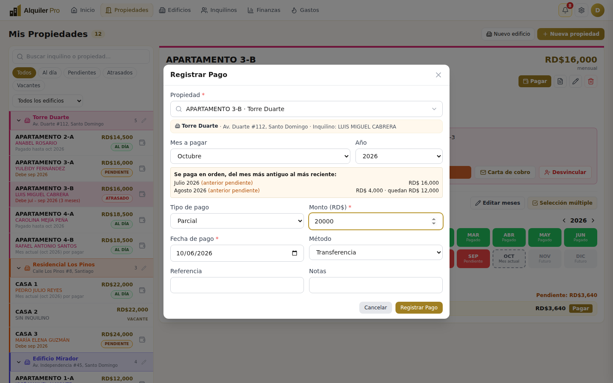

# Guía de uso · Alquiler Pro

**Español** · [English](USER_GUIDE.en.md) · [← Volver al README](../README.md)

Esta guía recorre la app pantalla por pantalla. Las capturas usan datos de demostración ficticios.

## Contenido

1. [Primeros pasos](#1-primeros-pasos)
2. [Edificios](#2-edificios)
3. [Propiedades](#3-propiedades)
4. [Inquilinos](#4-inquilinos)
5. [Registrar pagos](#5-registrar-pagos)
6. [Corregir el historial: editar meses](#6-corregir-el-historial-editar-meses)
7. [Servicios: gas, luz y agua](#7-servicios-gas-luz-y-agua)
8. [Recibos y reportes en PDF](#8-recibos-y-reportes-en-pdf)
9. [Buscar y filtrar](#9-buscar-y-filtrar)
10. [Alertas y registro de actividad](#10-alertas-y-registro-de-actividad)
11. [Equipo](#11-equipo)
12. [Finanzas](#12-finanzas)
13. [Carta de cobro](#13-carta-de-cobro)
14. [Preguntas frecuentes](#14-preguntas-frecuentes)

---

## 1. Primeros pasos

1. Crea tu cuenta en **Registro** e inicia sesión.
2. Ve a **Ajustes → Factura** (icono de engranaje) y completa: nombre del negocio, nombre del arrendador, teléfono, correo, pie de factura y tu **firma**. Estos datos aparecen en todos tus PDFs.
3. Navega con las pestañas del encabezado: **Inicio · Propiedades · Edificios · Inquilinos · Gastos**. El logo *Alquiler Pro* siempre te lleva al Inicio.

El **Inicio** reúne los indicadores del año, la lista de propiedades (agrupadas por edificio) con su estado de pago y el **registro de actividad**. La campana muestra las alertas de pago.

## 2. Edificios

**Edificios → + Nuevo edificio.** Indica nombre y dirección. Desde la misma pantalla puedes:

- **Editar** (lápiz) el nombre o la dirección. Si cambias la dirección, las unidades que tenían la del edificio se actualizan.
- **Eliminar** un edificio: sus propiedades **no se borran**, quedan "Sin edificio".
- **Asignar** propiedades sueltas a un edificio con el selector de la sección "Sin edificio".

Cada edificio tiene **su propio color** (automático y fijo) en la vista de Edificios y en Propiedades, junto con sus unidades e inquilinos, y las unidades aparecen en orden alfabético. Los círculos de cada unidad funcionan como semáforo: **verde** al día, **amarillo** 1 mes pendiente, **rojo** 2 o más meses y **gris** vacante; los contadores separan *Pendientes* y *Atrasadas*. Cada tarjeta muestra unidades, ocupación, renta mensual total y cuántas están atrasadas. **Pulsa el nombre del edificio (o "Ver")** para abrir su detalle.

### Detalle del edificio

Muestra los datos del edificio, sus indicadores (unidades, ocupación, renta mensual, monto atrasado) y todas sus unidades con inquilino y estado de pago. Puedes buscar, filtrar (Todas · Ocupadas · Vacantes · Atrasadas), **Cobrar** a una unidad ocupada, **Asignar inquilino** a una vacante, **Editar edificio** o **Agregar propiedad** (nace dentro del edificio y toma su dirección automáticamente).

## 3. Propiedades

**Propiedades → + Nueva propiedad.** Completa nombre o código, edificio (opcional; si lo eliges, la dirección es opcional), renta mensual, habitaciones y baños. Más abajo encontrarás datos adicionales (tipo, metros, notas).

**Registro todo en uno.** Al final del formulario, bajo la línea *opcional*, puedes registrar al **inquilino actual** (nombre, cédula, teléfono, correo, fecha de ingreso y depósito) y todo se guarda en un solo paso. Si lo dejas vacío, se crea solo la propiedad.

**Cambiar el precio.** Al editar el precio de una propiedad que ya tiene inquilino o pagos, elige **desde qué mes aplica** (por defecto, el siguiente). Los pagos ya cobrados y los meses anteriores conservan su monto: el histórico no se altera (requiere la migración 010 para conservar también el precio de los atrasos anteriores).

**Incremento anual (opcional).** Elige porcentaje o monto fijo y, si quieres, la **fecha del primer aumento**: el día en que entra en vigor por primera vez; luego se repite cada año en la misma fecha. En el detalle de la propiedad verás una línea como *"Aumento anual: 5% · próximo el 01/01/2027 → RD$19,425"*. Es informativo: la renta no cambia sola.

Para editar o eliminar una propiedad usa los iconos de la esquina superior derecha de su detalle. Eliminar borra también su historial; la app te pide confirmación.

## 4. Inquilinos

- **Asignar:** en el detalle de una propiedad vacante pulsa *Asignar inquilino* (o **Inquilinos → + Nuevo inquilino**: el selector muestra solo propiedades **disponibles**, con filtro por edificio y buscador). Pide nombre, cédula, teléfono, correo (opcional), **depósito (opcional)** y fecha de entrada.
- **Editar** los datos del inquilino actual: botón *Editar inquilino*.
- **Cambiar inquilino:** registra a uno nuevo; el anterior pasa a "Antiguos" con su historial.
- **Desvincular:** botón *Desvincular* (en la propiedad o en Inquilinos). La propiedad queda vacante y el inquilino pasa a **Antiguos**. **No se borra ningún pago.**

La pestaña **Inquilinos** tiene dos vistas: **Activos** (con su estado de pago) y **Antiguos** (histórico con propiedad, período, total pagado y detalle de cada pago, más *Reporte PDF* por inquilino).

> Al registrar un inquilino, la app marca como **pagados** los meses anteriores al mes pasado (histórico). Si en realidad ese inquilino llega con atrasos, corrígelo en [Editar meses](#6-corregir-el-historial-editar-meses).

## 5. Registrar pagos

### Un mes

Pulsa **Registrar pago** (Inicio) o **Pagar** (en la propiedad), o toca un mes pendiente del **Estado anual**. Elige la propiedad (con el buscador), el mes, el tipo (*completo* o *parcial*), fecha, método, referencia y notas. **Los pagos se aplican en orden, del mes más antiguo al más reciente**: elegir un mes significa *ponerme al día hasta ese mes*. El pago *completo* suma todo lo pendiente hasta ese mes; un pago *parcial* se descuenta primero de la factura pendiente más antigua y el resto pasa a la siguiente (el formulario muestra cómo se reparte). Los abonos parciales se acumulan hasta completar cada mes.

> Como se paga en orden, un mes **sin ningún registro** anterior a un mes ya pagado se considera saldado. Para reabrirlo, márcalo como *pendiente* con [Editar meses](#6-corregir-el-historial-editar-meses).

### Varios meses a la vez

En el detalle de la propiedad, sección **Pagos → Selección múltiple**: marca los meses pendientes (o usa *Marcar meses pendientes*) y pulsa **Pagar N meses**. Se registra el saldo de cada mes en un solo paso; si hay meses anteriores pendientes, se incluyen (marcados *anterior pendiente*).

### Recibo opcional

**Tu nombre en los documentos:** el encabezado, el bloque *Arrendador*, la firma y la marca de agua de recibos, reportes y cartas usan el *Nombre del arrendador* de **Ajustes → Factura** (si está vacío, el nombre de tu cuenta; si tampoco, tu correo). La marca de agua va detrás del texto. "Alquiler Pro" solo aparece en el pie. Estos ajustes son **del equipo**: todos los integrantes imprimen los mismos datos (requiere la migración 009).

Al guardar, la app pregunta **¿Desea imprimir el recibo?** — *Sí, imprimir* descarga el PDF; *Ahora no* continúa sin imprimir. Siempre puedes imprimirlo después desde el historial (icono de impresora).

### Editar o eliminar un pago

En el **Historial de pagos** cada fila tiene tres iconos: **imprimir**, **editar (lápiz)** y **eliminar**. Al editar puedes cambiar monto, fecha, método, referencia y notas; el saldo y el estado del mes se recalculan.

## 6. Corregir el historial: editar meses

Úsalo cuando el historial no refleja la realidad: por ejemplo, un inquilino que registras hoy pero **lleva meses sin pagar**, o meses en los que **no se cobró** porque el apartamento estuvo vacío.

1. En la propiedad, **Pagos → Editar meses** (icono de lápiz). Cambia el año con las flechas si hace falta.
2. Marca los meses que quieres corregir. Atajo: **Todos los meses hasta hoy**.
3. Elige:
   - **Marcar pendiente** — el mes se debe. Cuenta en el estado de pago y en el monto atrasado.
   - **Marcar nulo…** — el mes **no se cobró ni se cobrará**. Indica el motivo (apartamento vacío o desocupado, acuerdo con el propietario, mantenimiento u otro). No cuenta como deuda ni en la tasa de cobro; se ve gris rayado en el Estado anual.
   - **Quitar marca** — devuelve el mes a "sin registro".

**Reglas:** los meses con **pagos registrados** están bloqueados (candado): edita o elimina ese pago primero. Los meses de histórico generado automáticamente sí se pueden corregir. Los meses futuros no se editan.

## 7. Servicios: gas, luz y agua

**Gastos** tiene una pestaña por servicio. **+ Registrar lectura** pide propiedad, fecha y lectura actual; la app toma la lectura anterior, calcula el consumo y el costo con la tarifa que indiques. Cada lectura queda *Pendiente* hasta que pulses **Pagar**. En el detalle de cada propiedad también ves sus servicios y el pendiente.

## 8. Recibos y reportes en PDF

- **Recibo:** de un pago, o consolidado de varios (marca pagos en *Selección múltiple* → *Recibo*).
- **Reporte de pagos:** icono de documento en la propiedad, o **Reporte PDF** en un inquilino. Elige el año, el historial completo o los pagos marcados. Incluye datos del inquilino y edificio, total pagado, pendiente y la tabla de pagos.

Ambos usan el nombre del negocio, contacto y firma de **Ajustes → Factura**.

## 9. Buscar y filtrar

- En **Inicio** y **Propiedades**: buscador por inquilino o propiedad, filtros **Al día / Pendientes / Atrasados / Vacantes** y por **edificio**.
- Cuando eliges una propiedad en un formulario (pagos, asignar inquilino, servicios, reportes) aparece un **selector con buscador**: escribe parte del nombre, del edificio, de la dirección o del inquilino. Cada opción muestra su edificio e inquilino, así no confundes dos "Apartamento 1-A".

## 10. Alertas y registro de actividad

- **Campana** del encabezado: meses vencidos y próximos a vencer; cada alerta tiene *Registrar pago*.
- **Registro de actividad** (Inicio): pagos, ediciones, meses marcados, inquilinos, edificios, servicios, recibos y reportes, con **quién** lo hizo y **cuándo**.

## 11. Equipo

**Ajustes → Equipo** muestra al titular y a los miembros. El titular puede **agregar** una cuenta por correo (debe estar ya registrada en la app) o **quitarla**. Los miembros ven y editan los mismos datos y pueden **salir del equipo**.

## 12. Finanzas

**Finanzas** reúne el análisis del dinero. Arriba eliges el **año** y ves: lo **cobrado**, lo **esperado** (renta que correspondía cobrar hasta hoy, sin contar meses nulos), la **tasa de cobro**, el **pendiente por cobrar** (meses vencidos sin pagar), el promedio mensual y la renta perdida por unidades vacantes.

- **Cobrado por mes:** barras del dinero recibido frente a lo que correspondía (contorno punteado).
- **Estado de las propiedades:** al día, pendientes (1 mes), atrasadas (2 o más) y vacantes.
- **Por edificio:** cobrado, pendiente, tasa de cobro y unidades pendientes/atrasadas.
- **Mayores deudas** y **detalle por inquilino** (con búsqueda, orden por columnas, filtro *Solo con deuda* y **Exportar CSV** para Excel).
- **Cobrado por año:** el histórico de todos los años con pagos.

*Incluir historial generado* suma o no los meses que la app marcó como pagados al registrar a un inquilino (es el mismo criterio del indicador "Cobrado este año" de Inicio).

## 13. Carta de cobro

En **Ajustes → Carta de cobro** defines la carta que se envía a quien tiene meses pendientes. Escribe el texto y usa **variables** entre `<<` y `>>`; se reemplazan solas con los datos de cada inquilino. Haz clic en una variable para insertarla donde está el cursor.

| Variable | Se reemplaza por |
|---|---|
| `<<Nombre del inquilino>>`, `<<Cédula>>` | Datos del inquilino |
| `<<Propiedad>>`, `<<Edificio>>`, `<<Dirección>>` | Datos de la propiedad |
| `<<Meses pendientes>>` | Cantidad de meses vencidos sin pagar |
| `<<Detalle de meses>>` | "julio, agosto y septiembre de 2026" |
| `<<Monto adeudado>>`, `<<Renta mensual>>` | Montos en RD$ |
| `<<Fecha>>`, `<<Fecha límite>>` | Hoy y hoy + 5 días |
| `<<Nombre del propietario>>`, `<<Empresa>>`, `<<Teléfono>>`, `<<Correo>>` | Tus datos de Ajustes → Factura |

La **firma** se sube en esta misma pantalla (es la misma de Ajustes → Factura) y aparece en la vista previa y en el PDF. Hay dos **diseños base** (*Formal* y *Cordial*), opciones de membrete, tabla de meses adeudados y firma, una **vista previa en vivo** y un PDF de ejemplo. Una variable mal escrita se avisa y se imprime tal cual.

Para generar la carta de un inquilino con meses pendientes usa el botón **Carta de cobro** (icono de sobre) en el detalle de la propiedad, en **Inquilinos** o en **Finanzas**: se descarga en PDF. Guardar la plantilla requiere `008_letter_template.sql` (ver [DATABASE](DATABASE.md)).

## 14. Preguntas frecuentes

**Algo falló, ¿cómo doy evidencia?**
Entra a **Ajustes → Registro de errores**, pulsa **Copiar** (o **Descargar JSON**) y envía el contenido. Se guarda 7 días y no incluye contraseñas ni cédulas.

**¿Qué pasa si se cae el internet?**
La app muestra los últimos datos guardados y un aviso amarillo "Sin conexión". Puedes seguir viendo todo y **registrar pagos**: aparecen con la marca **Por enviar**, puedes imprimir su recibo y se envían solos al volver la conexión (una sola vez, aunque recargues). Editar, borrar o marcar meses necesita internet y te lo indica al instante. Lo único que no se puede es abrir la página desde cero sin conexión.

**¿Por qué un inquilino sale "Pendiente" si ya pagó?**
Revisa el mes: se debe el **mes anterior**, no el actual. Registra ese pago o, si no se cobró, márcalo como nulo en [Editar meses](#6-corregir-el-historial-editar-meses).

**¿Se pierde algo al desvincular un inquilino?**
No. Pasa a *Antiguos* con todos sus pagos y puedes sacar su reporte PDF.

**¿Qué diferencia hay entre "pendiente" y "nulo"?**
Pendiente = se debe. Nulo = no se cobró ni se cobrará (no cuenta como deuda).

**¿Por qué no puedo editar un mes?**
Si tiene pagos registrados está bloqueado (candado): edita o elimina el pago desde el historial. Los meses futuros tampoco se editan.

**Veo un aviso que pide ejecutar una migración.**
Esa función necesita una actualización de la base de datos. Pídele al administrador que ejecute el archivo indicado (ver [Base de datos](DATABASE.md)).
